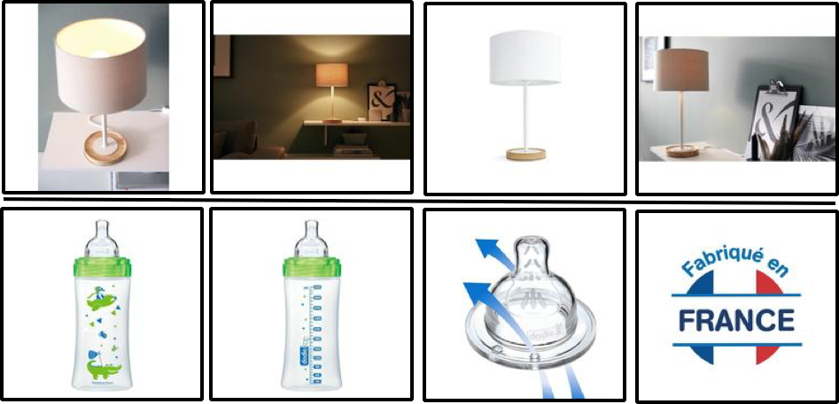
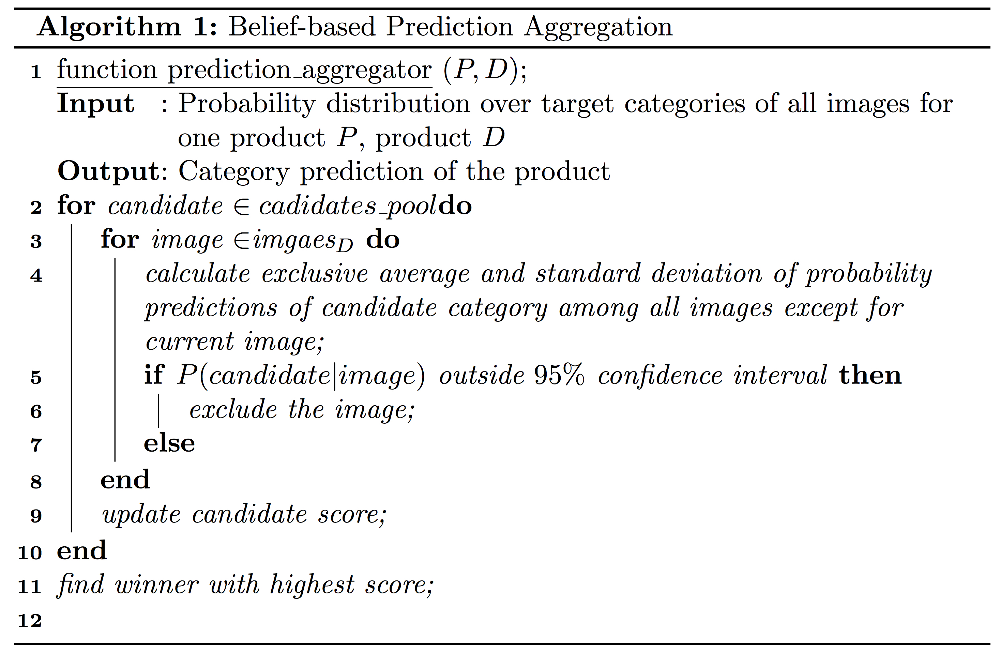

# Abstract
The main task of this project is about the so called Extreme Classification, where we need to deal with multi-class involving an extremely large number of labels. Specifically, the training set of Cdiscount dataset contains 12,118,359 images (6,924,452 products), and in total, there are 5,270 categories. The final goal of the project is to correctly predict products into these 5,270 categories. First, we experimented with several deep neural network models, including ResNet50, Se-ResNet50, ResNet101, InceptionV3, Xception, etc. with a limited training epochs, to test single model performance and set the baseline for further experiments. Then, we implemented Test Time Augmentation (TTA) and network ensembles to make whole framework more stable in testing stage. Then, in order to eliminate negative effect from noise data in prediction stage, we proposed a noise robust prediction aggregation algorithm. Finally, we used pseudo labeling to further fine-tune the trained neural network in a semi-supervised fashion, hoping to further generalize the model to the testing set and improve the model performance on product-wise prediction (i.e. not simply image-wise prediction). The proposed framework turns out to be more stable and effective than single base model.

# Introduction

In large e-commerce companies, the well categorization of products is
becoming a more and more challenging task since the list of products is
rapidly growing, and the number of categories is extremely large. Apart
from inefficient manually labeling, traditional machine learning methods
can be applied to automatically label the products and predict their
categories. Cdiscount.com, the France’s largest non-food e-commerce
company, is also facing the categorization problem due to its rapid
growing lists of products. Here we decide to build a deep neural network
classification framework to automatically categorize the images.

The main task in this project is about the so called Extreme
Classification with multi-class involving an extremely large number of
labels. Different from normal classification, Extreme Classification,
extreme classification task may involve a number of difficulties. First,
the computational complexity has been an issue for a long time. Second,
data scarcity remains a question despite the vastness of available data.
Additionally, the statistical dependence/correlation of the labels poses
challenges and opportunities for learning approaches. All the properties
of extreme classification problems (e.g. data and feature distribution)
and their specificities across different fields are still not well
understood. Moreover, valid evaluation measures in this setting have not
been fully and well settled.

Due to the fact that datasets in extreme classification exhibit fit to
power-law distribution,which indicates that a large fraction of labels
have very few positive instances in the data distribution, most
state-of-the-art approaches for extreme multi-label classification are
mainly focused on capturing correlation among labels by embedding the
label matrix to a low-dimensional linear sub-space.

Specifically, by assuming that the training label matrix is low-rank,
the effective number of labels can be reduced by projecting the high
dimensional label vectors onto a low dimensional linear subspace. Still,
leading embedding approaches have been unable to deliver high prediction
accuracies or scale to large problems as the low rank assumption is
violated in most real world applications.

In this project, we proposed a deep neural network ensemble based
classification framework on Cdiscount classification task. The pipeline
is shown in Figure 1 below.

<h4 align="center"> Figure 1. Whole pipeline </h4>

# Dataset

The open Cdiscount dataset contains almost 9 million products: half of
the current catalogue. There are more than 15 million images at 180x180
resolution with more than 5000 categories as shown in Table 1.

<h4 align="center"> Figure 2. Examples in Cdiscount dataset </h4>

|          |    Train   | Validation |    Test   |
|----------|:----------:|:----------:|:---------:|
| Images   | 12,118,359 |   252,934  | 3,095,080 |
| Products |  6,924,452 |   137,758  | 1,768,182 |

<h4 align="center"> Table 1. Cdiscount dataset overview </h4>

Specifically, the validation is carefully splitted from training set by
evenly sampling from each category.

# Related Work

## Extreme Classification

Extreme classification is a large-sacle classification task which
involves an extremely large number of labels one need to deal with. Due
to its complexity, multiple techniques such as distributed and parallel
training, label embedding, tree approaches @choromanska2013extreme are
usually combined together during the model training process. Solving
such problem requires not only better models but also more effective
approaches to ensemble @street2001streaming different part of the
system.

## ResNet

Residual network @he2016deep is a kind of neural network which consists
of many residual blocks. Within each block some convolutional layers are
stacked linearly and a shortcut connection is added to enable residual
learning. This network can be built with considerable depth without
being violated by degradation problem. There’re many classic ResNet
architectures such as ResNet-34, ResNet-50 and ResNet-101.

## Inception

The Inception architecture is first raised to address the problem of how
an optimal local sparse structure in a convolutional vision network can
be approximated and covered by readily available dense components
@szegedy2015going. It consists of several stacked inception modules
within which different types of convolutions are combined. The inception
module of the first version consists of $1\times1$, $3\times3$,
$5\times5$ convolutions and a $3\times3$ max pooling layer. In the later
versions, convolutions with large filter sizes are replaced by some more
smaller ones, which are further factorized into asymmetric convolutions.

## Xception

Xception is a network consisting of depthwise separable convolutions,
corresponding to the inception module of an inception network
@chollet2016xception. The depthwise separable convolutions first
performs channel-wise spatial convolution, and then perform $1\times1$
convolution, which entirely decouples the mapping of cross-channels
correlations and spatial correlations in feature maps. Xception is
proved to outperform the Inception V3 architecture on ImageNet dataset
and FastEval14k dataset.

# Methodology

## Deep Ensembles

Using single model can hardly achieve satisfactory performance in this
extreme large-scale classification task. To tackle this problem, we
first trained three state-of-the-art models: ResNet-101, Inception V3
and Xception as base models. These base models are trained using
different data augmentations so as to increase the invariance of the
ensemble. This can be seen a Bagging @dietterich2000experimental
approach to some extent. Then we assemble their predictions using a
noise robust algorithm(see in section 3.3).

## Test Time Augmentation (TTA)

Test time augmentation is a technique used to improve model performance
during testing process. After the models are trained, multiple
transformations will be applied to test images and each set of
transformed images will be fed into the network to get a prediction
@dieleman2015classifying. Then those prediction will be ensemble to get
a final prediction. In real application, dozens of transformations will
be applied (e.g. more than 10). However, in our experiment, we only
apply no more than three transformations to test its effectiveness due
to the computational cost.

Most TTA algorithm will take the average of the predictions to ensemble
the models. This method may have several drawbacks (i.e. not consider
the noisy data). To tackle this problem, we present a noise robust
method called Belief-based Prediction Aggregation(BBPA) as stated in
next section. This method can effectively exclude noisy data and thus
improve the performance of the whole model.

## Noise Robust Prediction Aggregation

### Motivation

The most common way to ensemble several models is to take the average
score of their predictions @dieleman2015classifying and then choose the
one with maximum probability. Although this approach is proved to be
effective, it is vulnerable to noisy data, especially in our task.

As shown in Figure 2, all four images belong to the same product: a
feeding bottle. The first three images depict, or at least partially
depict the main features of a feeding bottle. These images contain
information that can be easily exploited by a neural network, thus can
be considered as high quality images. The fourth image, however, should
be considered as noisy data because it is the logo of the brand of this
product. Although it is reasonable to classify it into the same category
as the other three images from the perspective of understanding from
human perspective, it is extremely difficult for a neural network to
successfully classify it based on visual appearance.

### Belief-based prediction aggregation

The intuition behind this algorithm is simple: we will try to exclude
the effect of noisy data while aggregating predictions made by different
models in order to get more accurate results.

To achieve this, we first apply Test Time Augmentation (TTA) to base
models. If we have $n$ base models and $m$ transformations in TTA, the
total number of predictions we will get is $n \times m$. Here, we define
each prediction as a new model since each prediction is from different
perspective.

Then for each new model, we choose one single category with the maximum
probability and put it into a candidate pool. All candidates in the pool
maybe the potential winner of this prediction after aggregation. Notice
that we could simply put all categories into the pool, but it is highly
computational expensive, thus we only allow each model to vote for one
category.

For each candidate category in the pool, we calculate the belief level
of each prediction from each model. We assume that all probabilities of
this category conform to Gaussian distribution. Then for each
prediction, if the value of its probability falls out of the $95\%$
confidence interval, we believe that it has low belief (i.e. noisy data)
and exclude it during ensembling process.

After we exclude all noisy data, we calculate the average score over all
models of all candidate categories and select the one with maximum
score. This category winner is our final prediction. The pseudo code is
shown below.

<h4 align="center"> Pseudocode for Belief-based prediction aggregation algorithm </h4>

## Pseudo-Labeling

Pseudo-Labeling @lee2013pseudo is a simple and efficient method of
semi-supervised learning. It is proven to be useful for training deep
neural networks in a semi-supervised fashion. For unlabeled data,
Pseudo-Labeling just picks up the class which has the maximum predicted
probability, and uses them as if they were true labels.

Because the total number of labeled data and unlabeled data is quite
different and the training balance between them is quite important for
the network performance, the overall loss function is adjusted to:
$$L = \frac{1}{n}\sum^{n}_{i=1}D(y_i, l_i) + \alpha(t)\frac{1}{n'}\sum^{n'}_{i=1}D(y'_i, l^{'}_i)$$

where $n$ is the number of batch size of labeled data, and $n'$ is the
number of unlabeled data, $y_i$ and $l_i$ is the predictions and labels
of the labeled data, and $y'_i$ and $l'_i$ is the predictions and labels
of the unlabeled data (i.e. testing dataset). As proved by \[1\], the
adjusted loss function is equivalent to Entropy Regularization. By
minimizing the entropy for unlabeled data, the overlap of class
probability distribution can be reduced. It favors a low-density
separation between classes, a commonly assumed prior for semi-supervised
learning @chapelle2009semi.

The well designed scheduling of $\alpha(t)$ is very essential for the
model performance. If $\alpha(t)$ is too high, it will result in
under-fitting on labeled data. If $\alpha(t)$ it too small,
Pseudo-Labeling is hard to make effect. In this case, the $\alpha(t)$ is
carefully designed to gradually increase within the threshold:
$$\alpha{t} = 
    \begin{cases}
      0, & t < T_1 \\
      \frac{t-T_1}{T_2-T_1}, & T_1 \leqslant t \leqslant T_2 \\
      \alpha_f, & T_2 < t
    \end{cases}$$ with $\alpha_f = x$, $T_1 = x$, and $T_2 = x$ in our
experiments.

In general, there are two strategies of how to use Pseudo-Labels. The
first is called Batch Pseudo-Labels where they are updated or
recalculated once all unlabeled data is used (i.e. every epoch of
unlabeled data). The other way is called Mini-batch Pseudo-Labels where
they are re-calculated every weights update after each mini-batch.

In our project, due to the computational cost, we choose to use Batch
Pseudo-Labels, which means we only update these Pseudo-labels after
using all of the unlabeled data.

# Experiments

The experiment environment is set based on Tesla K80 Accelerators with
one GPU of 12 GiB of memory. First, the base deep neural networks are
fine-tuned on the pre-trained models from Pytorch. Each base model is
only trained few epochs (e.g. around 5) due to the significant
computational cost resulting from large amount of training data. The SGD
with scheduled learning rate is chosen as the optimizer during training.
Different training augmentations, including random resize, flip, shift,
crop, rotate, etc., are used for different base models. Specific
training details of four models are shown in Table 2, and the validation
accuracy results are shown in Figure 3.

|                |  Se-ResNet-50 (Baseline)  | Inception | Xception |         ResNet-101        |
|----------------|:-------------------------:|:---------:|:--------:|:-------------------------:|
| Input Size     | 160*160 crop from 180*180 |  180*180  |  180*180 | 160*160 crop from 180*180 |
| Batch          |           160*2           |    64*4   |   64*4   |            64*4           |
| Time per epoch |           55.54h          |    31h    |    31h   |            64*4           |

<h4 align="center"> Table 2. Single base model settings </h4>

As shown in Table 4, network ensembles improve the performance of the
whole framework significantly, which sufficiently demonstrates the
effectiveness of deep ensembles. Second, the performance improvement of
TTA is not very significant. This is expected as we only conducted 2-way
transformations due to high computational cost over large amount of
data. It is expected that the performance can be further improved with
more sophisticated transforms, but within the limited range. Third,
pseudo-labeling turns out to help the models further generalize on
testing data, which bring improvement as well.

|                                                  | Validation Acc |
|--------------------------------------------------|:--------------:|
| Resnet-101-baseline                              |      0.638     |
| Resnet-101-TTA(1-2)                              |      0.648     |
| Ensemble(ResNet101+Inception+Xception)-TTA (1-1) |      0.653     |

<h4 align="center"> Table 4. Comparison of performance on validation set </h4>

# Observations

|                            | Test Acc |
|----------------------------|:--------:|
| Resnet-101-baseline        |   0.683  |
| Resnet-101-TTA(1-2)        |   0.703  |
| Resnet-101-Pseudo-Labeling |   0.695  |

<h4 align="center"> Table 5. Comparison of performance on test set </h4>

As shown in Table 5, Batch Pseudo Labeling helps improve the performance
of the model on the testing set. We contributed this to the regularizing
effect of Pseudo Labeling. When pseudo-labeled test data is added to the
training set, the network is optimized (or constrained) to generate
predictions similar to the pseudo-labels for all possible variations and
transformations of the data resulting from augmentation. This makes the
network more invariant to these transformations, and forces the network
to make more meaningful predictions. It also helps generalize the model
on the unseen data.

In the later training stage, where the network starts to converge slowly
but have not saturated yet, we observed that by increasing the batch
size rather than decay the learning rate could help network further
converge. This matches the observation from @smith2017don.

# Conclusion

Extreme classification introduces a number of difficulties. First of
all, the dataset is usually extremely large, which brings in
significantly large computational cost both in training and testing
stage. Secondly, the dataset often contains a lot of noise which
requires a more robust framework. Thirdly, due to the large number of
categories, a single model is insufficient and incapable in most cases.
To deal with these problems and more specific problems resulting from
Cdiscount dataset, we proposed a deep neural network ensembles together
with a noise robust prediction aggregation framework. As shown above,
the proposed framework has more better performance over testing dataset
than single base model, and our belief-based prediction aggregation,
together with the TTA and pseudo-labeling, further improves the overall
performance.

# Future work

There are several directions of improvement for this experiment. First,
the transformations we used in Test Time Augmentation are with random
parameters within a given range. The future work could focus on finding
the optimal augmentation parameters by: (1) manually optimizing the
transformation parameters to maximize (or minimize) the confidence of
the predictions; (2) training a network to predict the optimal
transformation parameters; (3) implementing affine transformations as
layers in the network, so as to backpropagate through them.

Second, the assumption we made that the prediction probabilities conform
to a Gaussian distribution is not sufficiently proved. Although using
such distribution is proved to be very effective, we could further
investigate the distribution over the observed probability space and
give a better estimation which might further improve the effectiveness
of prediction aggregation.

Third, since all images of this dataset are related to e-commerical
products, there might be a hierarchy structure among the massive number
of categories. In such case, we might be able to integrate hierarchy
classification layers into our network, which could decrease the chance
of misclassification at the early stage and improve the accuracy of
prediction.

# Contributions

Part of the work is inspired by @Heng CherKeng on Kaggle.

# References
[1] O. Chapelle, B. Scholkopf, and A. Zien. Semi-supervised learning (chapelle, o. et al., eds.; 2006)[book reviews]. IEEE Transactions on Neural Networks, 20(3):542–542, 2009.

[2] F. Chollet. Xception: Deep learning with depthwise separa- ble convolutions. arXiv preprint arXiv:1610.02357, 2016.

[3] A. Choromanska, A. Agarwal, and J. Langford. Extreme multi class classification. In NIPS Workshop: eXtreme Clas- sification, submitted, 2013.

[4] S. Dieleman, A. van den Oord, I. Korshunova, J. Burms, J. Degrave, L. Pigou, and P. Buteneers. Classifying plank- ton with deep neural networks. Blog entry, 3:4, 2015.

[5] T.G.Dietterich.Anexperimentalcomparisonofthreemeth- ods for constructing ensembles of decision trees: Bagging, boosting, and randomization. Machine learning, 40(2):139– 157, 2000.

[6] K. He, X. Zhang, S. Ren, and J. Sun. Deep residual learn- ing for image recognition. In Proceedings of the IEEE con- ference on computer vision and pattern recognition, pages 770–778, 2016.

[7] D.-H. Lee. Pseudo-label: The simple and efficient semi- supervised learning method for deep neural networks. In Workshop on Challenges in Representation Learning, ICML, volume 3, page 2, 2013.

[8] S. L. Smith, P.-J. Kindermans, and Q. V. Le. Don’t decay the learning rate, increase the batch size. arXiv preprint arXiv:1711.00489, 2017.

[9] W. N. Street and Y. Kim. A streaming ensemble algorithm (sea) for large-scale classification. In Proceedings of the sev- enth ACM SIGKDD international conference on Knowledge discovery and data mining, pages 377–382. ACM, 2001.

[10] C. Szegedy, W. Liu, Y. Jia, P. Sermanet, S. Reed, D. Anguelov, D. Erhan, V. Vanhoucke, and A. Rabinovich. Going deeper with convolutions. In Proceedings of the IEEE conference on computer vision and pattern recogni- tion, pages 1–9, 2015.
